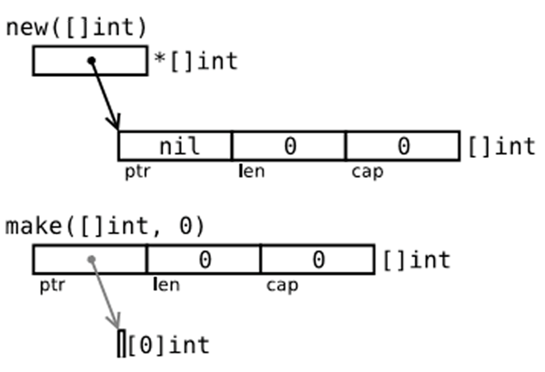
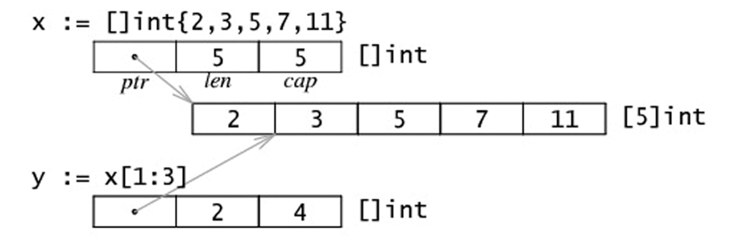
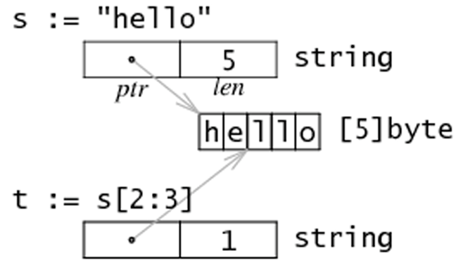
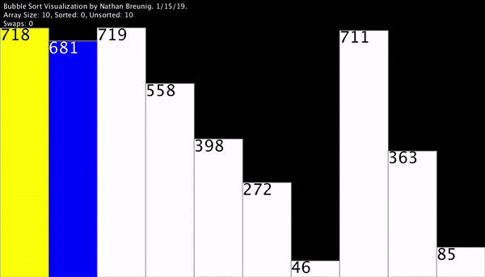
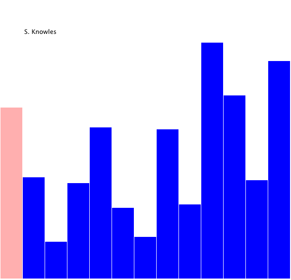
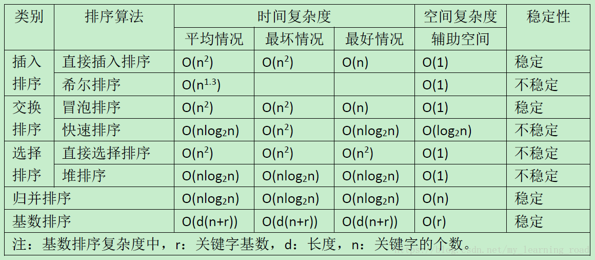
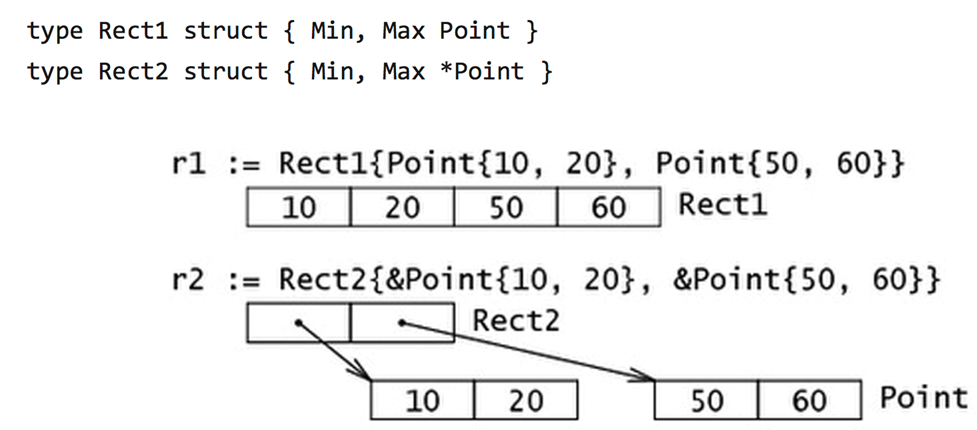

# Golang Advanced

- [Golang Advanced](#golang-advanced)
	- [builtin](#builtin)
	- [Recursive](#recursive)
	- [Closure](#closure)
	- [array & slice](#array--slice)
	- [string](#string)
	- [sort](#sort)
	- [map](#map)
	- [3rd package](#3rd-package)
	- [sync](#sync)
	- [struct](#struct)
		- [linked-list](#linked-list)
- [output](#output)
		- [doubly linked list](#doubly-linked-list)
		- [tree](#tree)

## builtin

[Golang builtin](https://golang.org/pkg/builtin/)
- `close`: close channel
- `len`: 求string, array, slice, map, channle长度
- `new`: 给值类型数据(int, struct,...)分配内存，返回指针
- `make`: 给引用类型数据(chan, map, slice)分配内存
- `append`: 追加元素到slice
- `panic`, `recover`: 错误处理

example: `new`

```go
package main

import "fmt"

func main() {
	a := 100
	fmt.Println(a)        // 100
	fmt.Printf("%T\n", a) // int

	b := new(int)
	fmt.Println(b)        // 0xc0000660b8
	fmt.Printf("%T\n", b) // *int

	*b = 666
	fmt.Println(*b) // 666
}
```

`new` vs `make`
> `new`: `func new(Type) *Type`  
> `make`: `func make(t Type, size ...IntegerType) Type`
- golang引用类型的0值为`nil`
- [new vs make](https://sanyuesha.com/2017/07/26/go-make-and-new/)

example: 

```go
package main

import "fmt"

func main() {
	var s0 int
	fmt.Printf("%T, %v\n", s0, s0) // int, 0

	var s1 []int                   // slice
	fmt.Printf("%T, %v\n", s1, s1) // []int, []
	fmt.Println(s1 == nil)         // true
	fmt.Printf("%p\n", s1)         //0x0

	p1 := new(int)
	fmt.Printf("%T, %v\n", p1, p1)   // *int, 0xc0000120d0
	fmt.Printf("%T, %v\n", *p1, *p1) // int, 0

	p2 := new([]int)
	fmt.Printf("%T, %v\n", p2, p2)   // *[]int, &[]
	fmt.Printf("%T, %v\n", *p2, *p2) // []int, []
	fmt.Println(p2 == nil)           //false
	fmt.Println(*p2 == nil)          //true

	m0 := make([]int, 0)
	fmt.Printf("%T, %v\n", m0, m0) // []int, []

	m1 := make([]int, 3, 10)       // len=3, capacity=10
	fmt.Printf("%T, %v\n", m1, m1) // []int, [0 0 0]
	m1[0] = 666
	fmt.Printf("%T, %v\n", m1, m1) // []int, [666 0 0]

	// trick
	*p2 = make([]int, 3)
	(*p2)[0] = 111
	fmt.Printf("%T, %v\n", *p2, *p2) // []int, [111 0 0]
}
```

p2 vs m0:
> 

example: struct with `new`

```go
package main

import "fmt"

type Person struct {
	name string
	age  int
}

func main() {
	// method1.1
	var p1 Person
	fmt.Printf("%#v\n", p1) // main.Person{name:"", age:0}
	p1.age = 11
	fmt.Printf("%#v\n", p1) //main.Person{name:"", age:11}

	// method1.2
	p2 := Person{}
	fmt.Printf("%#v\n", p2) // main.Person{name:"", age:0}
	p2.age = 11
	fmt.Printf("%#v\n", p2) //main.Person{name:"", age:11}

	// method2.1
	p3 := &Person{}
	fmt.Printf("%#v\n", p3) // &main.Person{name:"", age:0}
	// 可以用指针直接访问成员变量
	p3.age = 11
	fmt.Printf("%#v\n", p3) // &main.Person{name:"", age:11}

	// method2.2
	p4 := new(Person)       // p4 type is *Person
	fmt.Printf("%#v\n", p4) // &main.Person{name:"", age:0}
	// 可以用指针直接访问成员变量
	p4.age = 11
	fmt.Printf("%#v\n", p4) // &main.Person{name:"", age:11}
}
```

example: `append`

```go
package main

import "fmt"

func main() {
	a := []int{1, 2} // slice
	// append 第一个参数必须是slice
	a = append(a, 10, 20)
	fmt.Println(a) // [1 2 10 20]

	a = append(a, a...) // double a
	fmt.Println(a)      // [1 2 10 20 1 2 10 20]
}
```

example: `panic` & `recover`
> `panic`是错误; `recover`负责捕获

```go
package main

import (
	"fmt"
	"time"
)

func test() {

	defer func() {
		if err := recover(); err != nil {
			fmt.Println(err)
			// then write to log or alarm user
		}
	}()

	a := 0
	b := 10 / a
	fmt.Println(b)
	return
}

func main() {
	for {
		test()
		time.Sleep(time.Second)
	}
}
```

example: custom `panic`

```go
package main

import (
	"errors"
	"fmt"
	"time"
)

func initConfigErr() (err error) {
	return errors.New("init config failed")
}

func test() {
	defer func() {
		if err := recover(); err != nil {
			fmt.Println(err)
			// then write to log or alarm user
		}
	}()

	err := initConfigErr()
	if err != nil {
		panic(err)
	}
	return
}

func main() {
	for {
		test()
		time.Sleep(time.Second)
	}
}
```

## Recursive

- 一个大的问题能够分解成相似的小问题
- 定义好出口条件

example: recursive main function

```go
package main

import (
	"fmt"
	"time"
)

func main() {
	fmt.Println("grey")
	time.Sleep(time.Second)
	main()
}
```

example: fibonacci

```go
package main

import (
	"fmt"
)

func fibonacci(n int) int {
	if n <= 1 {
		return 1
	}
	return fibonacci(n-1) + fibonacci(n-2)
}

func main() {
	for i := 0; i < 5; i++ {
		fmt.Println(fibonacci(i))
	}
}
```

## Closure

Closure: 一个函数和与其相关的引用环境组合而成的实体

example: simple closure

```go
package main

import (
	"fmt"
)

func adder() func(int) int {
	var x int
	return func(delta int) int {
		x += delta
		return x
	}
}

func main() {
	f := adder()
	// 闭包本质就是将x与f绑定在一起, 相当于容纳了x和f的class
	fmt.Println(f(10)) // 10
	fmt.Println(f(20)) // 30
	fmt.Println(f(30)) // 60
}
```

```go
package main

import (
	"fmt"
	"strings"
)

func makeSuffix(suffix string) func(string) string {
	return func(name string) string {
		if !strings.HasSuffix(name, suffix) {
			return name + suffix
		}
		return name
	}
}

func main() {
	makeBmp := makeSuffix(".bmp")
	makePng := makeSuffix(".png")
	fmt.Println(makeBmp("test"))      // test.bmp
	fmt.Println(makePng("hello.jpg")) // hello.jpg.png
}
```

## array & slice

数组: 是同一种数据类型的固定长度的序列, `var a [5]int`
> `var a [5]int`与`var a [10]int`是不同的数据类型  
> 如果下标在数组合法范围之外，则触发访问越界，会panic

example: array值类型

```go
package main

import (
	"fmt"
)

func modifyArray1(arr [4]int) {
	arr[0] = 999
}

func modifyArray2(arr *[4]int) {
	(*arr)[0] = 111
}

func main() {
	a := [4]int{1, 2}

	b := a
	b[0] = 666     // 不改变a
	fmt.Println(a) // [1 2 0 0]

	modifyArray1(a)
	fmt.Println(a) // [1 2 0 0]

	modifyArray2(&a)
	fmt.Println(a) // [111 2 0 0]
}
```

example: fabonacci

```go
package main

import "fmt"

func fabonacci(n int) {
	if n == 0 || n == 1 {
		fmt.Println(1)
	}

	x0 := 1
	x1 := 1
	for i := 2; i <= n; i++ {
		fmt.Println(x0, x1)
		x0 = x0 + x1
		x1 = x1 + x0
	}
}

func main() {
	fabonacci(4)
}
```

example:fabonacci by array

```go
package main

import "fmt"

func fabonacci(n int) {
	a := make([]int, n)
	a[0] = 1
	a[1] = 1
	for i := 2; i < n; i++ {
		a[i] = a[i-1] + a[i-2]
	}

	for _, v := range a {
		fmt.Printf("%v,", v)
	}
}

func main() {
	fabonacci(10)
}
```

example: array initialization

```go
package main

import "fmt"

func main() {
	var a1 [5]int = [5]int{1, 2, 3}
	var a2 = [5]int{11, 22}
	a3 := [5]int{3, 4}
	a4 := [...]int{22, 33, 44, 55}
	fmt.Println(a1, a2, a3, a4)

	a5 := [5]int{2: 666, 4: 999}
	fmt.Println(a5) // [0 0 666 0 999]
}
```

example: multi-dimension array

```go
package main

import "fmt"

func main() {
	a := [2][3]int{{1, 2, 3}, {11, 22}}
	fmt.Println(a)

	for i := 0; i < 2; i++ {
		for j := 0; j < 3; j++ {
			fmt.Printf("%v,", a[i][j])
		}
		fmt.Println()
	}

	for i, row := range a {
		for j, v := range row {
			fmt.Printf("a[%v][%v]=%v\n", i, j, v)
		}
	}
}
```

slice: 切片是数组的一个引用，因此切片是引用类型
> `var s []int`
> 切片的长度可以改变，因此，切片是一个可变的数组; 切片遍历方式和数组一样，可以用`len()`求长度, `cap()`求最大容量;  

```go
package main

import "fmt"

func main() {
	// 标准做法
	a0 := make([]int, 3, 10)
	fmt.Println(a0, len(a0), cap(a0)) // [0 0 0] 3 10

	a := []int{1, 2, 3}
	fmt.Println(a)

	arr := [5]int{11, 22, 33, 44, 55}
	var b []int
	fmt.Printf("%T, %v\n", b, b) // []int, []
	fmt.Println(b == nil)        //true
	b = arr[3:]
	fmt.Printf("%T, %v\n", b, b) // []int, [44 55]

	c := arr[:]
	fmt.Println(c) // [11 22 33 44 55]

	d := arr[:len(arr)-1]
	fmt.Println(d) // [11 22 33 44]
	e := d[1:]
	fmt.Println(e, len(e), cap(e)) // [22 33 44] 3 4
}
```

example: slice 内存结构
> 

```go
// slice底层数据结构
type slice struct{
    ptr *[5]int
    len int
    cap int
}
```

```go
package main

import "fmt"

func main() {
	x := []int{2, 3, 5, 7, 11}
	y := x[1:3]
	fmt.Println(x, len(x), cap(x)) // [2 3 5 7 11] 5 5
	// 切片的容量是从它的第一个元素开始数，到其底层数组元素末尾的个数。
	fmt.Println(y, len(y), cap(y)) // [3 5] 2 4
}
```

examle: golang 数组指针

```go
p := new([4]int)
fmt.Printf("%#v\n", p) // &[4]int{0, 0, 0, 0}
(*p)[0] = 100
// 编译器做了转换，也可以如下
p[1] = 200
fmt.Printf("%#v\n", p) // &[4]int{100, 200, 0, 0}
```

example: custom slice

```go
package main

import "fmt"

type slice struct {
	ptr *[10]int
	len int
	cap int
}

func makeSlice(s slice, len int, cap int) slice {
	s.ptr = new([10]int)
	s.len = len
	s.cap = cap
	return s
}

func modifySlice(s slice) {
	// 虽然slice本身是值类型，但里面有指针，所以可以改
	s.ptr[1] = 111
}

func main() {
	var s1 slice
	s1 = makeSlice(s1, 3, 10)

	s1.ptr[0] = 100
	fmt.Printf("%#v\n", s1.ptr) // &[10]int{100, 0, 0, 0, 0, 0, 0, 0, 0, 0}
	modifySlice(s1)
	fmt.Printf("%#v\n", s1.ptr) // &[10]int{100, 111, 0, 0, 0, 0, 0, 0, 0, 0}
}
```

example: modify array or slice
> 默认的slice是引用类型  
> slice的本质是对array的引用

```go
package main

import "fmt"

func main() {
	a := [5]int{1, 2, 3, 4}
	b := a[1:]
	fmt.Printf("%p\n", &a)    // 0xc000084060
	fmt.Printf("%p\n", &a[0]) // 0xc000084060
	fmt.Printf("%p\n", &a[1]) // 0xc00000a2d8
	// slice可以简单理解为指针,存的地址，所以直接%p
	fmt.Printf("%p\n", b)     // 0xc00000a2d8
}
```

```go
package main

import "fmt"

func modifyArray1(arr []int) {
	arr[0] = 111
}

func modifyArray2(arr *[5]int) {
	arr[1] = 222
}

func modifyArray3(arr *[5]int) {
	(*arr)[2] = 333
}

func main() {
	a := [5]int{1, 2, 3, 4}

	modifyArray1(a[:])
	fmt.Printf("%#v\n", a) //[5]int{111, 2, 3, 4, 0}

	modifyArray2(&a)
	fmt.Printf("%#v\n", a) //[5]int{111, 222, 3, 4, 0}

	modifyArray3(&a)
	fmt.Printf("%#v\n", a) // [5]int{111, 222, 333, 4, 0}

	b := a[1:]
	modifyArray1(b)
	fmt.Printf("%#v\n", b) //[]int{111, 3, 4, 0}
	fmt.Printf("%#v\n", a) //[5]int{111, 111, 3, 4, 0}
}
```

创建slice的方式:
- 通过一个array的引用`[start: end]`来创建
- `make`来创建，底层本质是指向array的引用
- 初始化的时候就创建，然后`append`: `var a:=[]int{1, 2, 3}`

```go
package main

import "fmt"

func main() {
	a := []int{1, 2, 3}
	b := []int{4, 5, 6}
	c := append(a, b...)
	fmt.Println(c) // [1 2 3 4 5 6]
	d := append(c, 100)
	fmt.Println(d) //[1 2 3 4 5 6 100]
}
```

example: `append`导致capacity扩容 

```go
package main

import "fmt"

func main() {
	a := [5]int{1, 2, 3, 4, 5}
	s := a[1:4]
	fmt.Println(len(s), cap(s))             // 3 4
	fmt.Printf("s=%p, a[1]=%p\n", s, &a[1]) // s=0xc000080068, a[1]=0xc000080068

	s = append(s, 10)
	fmt.Printf("s=%p, a[1]=%p\n", s, &a[1]) // s=0xc000080068, a[1]=0xc000080068

	s = append(s, 10)
	// 已经填满了，所以要重新开辟内存
	fmt.Printf("s=%p, a[1]=%p\n", s, &a[1]) // s=0xc000082140, a[1]=0xc000080068
	fmt.Println(len(s), cap(s))             // 5 8
}
```

example: slice copy

```go
package main

import "fmt"

func main() {
	a := []int{1, 2, 3, 4, 5}
	b := make([]int, 10)
	c := make([]int, 3)
	copy(b, a)
	fmt.Println(a, b) // [1 2 3 4 5] [1 2 3 4 5 0 0 0 0 0]

	copy(c, a)
	fmt.Println(a, c) // [1 2 3 4 5] [1 2 3]

	a = append(a, 11, 22)
	fmt.Println(a) // [1 2 3 4 5 11 22]
}
```

## string

string底层布局: string底层就是一个byte的数组(不可修改)，因此，也可以进行切片操作;
> 

```go
package main

import "fmt"

func main() {
	s := "hi, 中国"
	fmt.Println(s[:5]) // hi, �
	sr := []rune(s)
	fmt.Println(string(sr[:5])) //hi, 中
}
```

example: 强行修改string

```go
package main

import "fmt"

func main() {
	s1 := "hi,china"
	s := []byte(s1)
	s[1] = 'a'
	s1 = string(s)
	fmt.Println(s1) //ha,china

	s2 := "hi,中国"
	ss := []rune(s2)
	ss[3] = '美'
	s2 = string(ss)
	fmt.Println(s2) // hi,美国
}
```

## sort

[some functions](https://go-zh.org/pkg/sort/):
- `sort.Ints(a []int)`: sort integer
- `sort.Float64s`
- `sort.Strings`
- `sort.SearchInts(a []int, b int)`: find b in sorted a
- `sort.SearchFloats(a []float64, b float64)`
- `sort.SearchStrings(a []string, b string)`

example: sort slice

```go
package main

import (
	"fmt"
	"sort"
)

func main() {
	s1 := []int{12, 1, 3, 11}
	sort.Ints(s1)
	fmt.Println(s1) // [1 3 11 12]

	i := sort.SearchInts(s1, 3)
	fmt.Println(i) // 1

	// reverse order
	sort.Sort(sort.Reverse(sort.IntSlice(s1)))
	fmt.Println(s1)
}
```

example: bubble sort
> 

```go
package main

import "fmt"

// bubble sort
func bsort(a []int) {
	N := len(a)
	for i := 0; i < N-1; i++ {
		for j := 0; j < N-1-i; j++ {
			if a[j] > a[j+1] {
				a[j], a[j+1] = a[j+1], a[j]
			}
		}
	}
}

func main() {
	arr := []int{1, 11, 3, 12, 2}
	bsort(arr)
	fmt.Printf("%#v\n", arr) // []int{1, 2, 3, 11, 12}
}
```

example: selection sort
> 

```go
package main

import "fmt"

// select sort
func ssort(a []int) {
	N := len(a)
	for i := 0; i < N-1; i++ {
		minIdx := i
		for j := i + 1; j < N; j++ {
			if a[minIdx] > a[j] {
				minIdx = j
			}
		}
		a[i], a[minIdx] = a[minIdx], a[i]
	}
}

func main() {
	arr := []int{1, 11, 3, 12, 2}
	ssort(arr)
	fmt.Printf("%#v\n", arr) // []int{1, 2, 3, 11, 12}
}
```

example: insertion sort
> 

```go
package main

import "fmt"

// insertion sort
func isort(a []int) {
	N := len(a)
	for i := 1; i < N; i++ {
		for j := i; j > 0; j-- {
			if a[j] < a[j-1] {
				a[j], a[j-1] = a[j-1], a[j]
			}
		}
	}
}

func main() {
	arr := []int{1, 11, 3, 12, 2}
	isort(arr)
	fmt.Printf("%#v\n", arr) // []int{1, 2, 3, 11, 12}
}
```

example: quick sort
> core: 对于一个元素，左边的分块都大于它，右边的分块都小于它；进而确定该元素的在序列中的index; 递归下去  
> 

```go
package main

import "fmt"

// quick sort
func qsort(a []int, left, right int) {
	if left >= right {
		return
	}

	// 确定val的位置k，并以k为界分两边
	val := a[left]
	k := left
	for i := left + 1; i <= right; i++ {
		if a[i] < val {
			a[k] = a[i]
			a[i] = a[k+1]
			k++
		}
		fmt.Println(a)
	}
	a[k] = val

	// fmt.Println("Begin left")
	qsort(a, left, k-1)
	// fmt.Println("End left")

	// fmt.Println("Begin right")
	qsort(a, k+1, right)
	// fmt.Println("End right")
}

func main() {
	arr := []int{3, 11, 12, 2, 1}
	qsort(arr, 0, len(arr)-1)
	fmt.Printf("%#v\n", arr) // []int{1, 2, 3, 11, 12}
}
```

example: merge sort(归并排序)
> 

example: sort summary
> 

## map

map: key-value数据结构
> 声明是不会分配内存的，初始化需要make  
> `var xxx map[string] int`

example: value又是一个map的嵌套结构
> `var xxx map[string] map[string] int`

example: map CRUD

```go
package main

import (
	"fmt"
)

func main() {
	// method1
	d1 := map[string]int{"id": 1, "age": 18}
	fmt.Printf("%#v\n", d1)
	// method2
	d2 := make(map[string]int, 10)
	// insert & update
	d2["id"] = 2
	d2["age"] = 16
	fmt.Printf("%#v\n", d2)

	// find
	v, ok := d2["age"]
	fmt.Println(v, ok) // 16 true

	// iter
	for k, v := range d2 {
		fmt.Println(k, v)
	}

	fmt.Println(len(d2)) // 2

	// delete
	delete(d2, "age")
	fmt.Printf("%#v\n", d2)
}
```

trick: 删除所有key-value
1. 循环每一个都delete
2. 重新make, 换指向

example: 两层dict

```go
package main

import (
	"fmt"
)

func main() {
	d1 := map[string]map[string]int{"grade": {"id": 1, "age": 12}}
	fmt.Printf("%#v\n", d1) // map[string]map[string]int{"grade":map[string]int{"age":12, "id":1}}
	d1["score"] = make(map[string]int)
	d1["score"]["math"] = 100
	d1["score"]["english"] = 99
	fmt.Printf("%#v\n", d1) // map[string]map[string]int{"grade":map[string]int{"age":12, "id":1}, "score":map[string]int{"english":99, "math":100}}
}
```

```go
package main

import "fmt"

func check(a map[string]map[string]string) {
	_, ok := a["root"]
	if !ok {
		a["root"] = make(map[string]string)
	}

	a["root"]["password"] = "toor"
	a["root"]["nickname"] = "grey"
}

func main() {
	db := map[string]map[string]string{}
	check(db)
	fmt.Printf("%#v\n", db) //map[string]map[string]string{"root":map[string]string{"nickname":"grey", "password":"toor"}}
}
```

example: map 是引用类型

```go
package main

import (
	"fmt"
)

func modifyDict(d map[string]int) {
	d["age"] = 55
}

func main() {
	d1 := map[string]int{"age": 18, "id": 10}
	modifyDict(d1)
	fmt.Printf("%#v\n", d1)
}
```

example: slice of map

```go
items:=make([]map[int]int, 5)

if items[0]==nil{
    items[0]=make(map[int]int)
}
items[0][666]=999

for i := 0; i < 5; i++ {
    items[i]=make(map[int]int)
}
```

> map本质上是无序的， 所有每次打印结果都不同
example: map有序打印
1. 先获取所有key，把key进行排序
1. 按照排序好的key，进行遍历

example: map反转
- 初始化另外一个map，把key、value互换即可

## 3rd package

example: `go get -u github.com/asmcos/requests`

## sync

检测多个goroutine之间是否发生线程竞争:
1. go build -race main/main.go
1. ./main.exe


example: 互斥锁(Mutex)

```go
package main

import (
	"fmt"
	"math/rand"
	"sync"
)

var lock sync.Mutex

func test(b map[string]int) {
	lock.Lock()
	b["age"] = rand.Intn(100)
	lock.Unlock()
}

func main() {
	a := map[string]int{"id": 10, "age": 11}
	for i := 0; i < 2; i++ {
		go test(a)
	}

	// 防止与主routine发生争抢
	lock.Lock()
	fmt.Println(a)
	lock.Unlock()
}
```

example: 读写锁(RWMutex)
> 读操作的时候可以多个线程; 写操作的时候仍然是互斥锁  
> 应用场景: 读多写少，游戏

```go
package main

import (
	"fmt"
	"math/rand"
	"sync"
	"sync/atomic"
	"time"
)

var lock sync.RWMutex

// atomic number
var rcount int32
var wcount int32

func readOp(b map[string]int) {
	lock.RLock()
	fmt.Println(b["age"])
	lock.RUnlock()
	atomic.AddInt32(&rcount, 1)
}

func writeOp(b map[string]int) {
	lock.Lock()
	b["age"] = rand.Intn(100)
	lock.Unlock()
	atomic.AddInt32(&wcount, 1)
}

func init() {
	rand.Seed(time.Now().UnixNano())
}

func main() {
	a := map[string]int{"id": 10, "age": 11}

	// 2个线程写
	for i := 0; i < 2; i++ {
		go writeOp(a)
	}
	// 100个线程读
	for j := 0; j < 100; j++ {
		go readOp(a)
	}

	time.Sleep(5 * time.Second)
	fmt.Println(atomic.LoadInt32(&rcount))
	fmt.Println(atomic.LoadInt32(&wcount))
}
```

example: 比较读写锁与互斥锁性能
> 将如下的读写锁换成互斥锁，对比rcount，读写锁性能是互斥锁的100倍  
> 100倍原因: 互斥锁每次只能一个协程读操作，然而对于RLock可以同时100协程的读操作

```go
package main

import (
	"fmt"
	"math/rand"
	"sync"
	"sync/atomic"
	"time"
)

var lock sync.RWMutex

// atomic number
var rcount int32
var wcount int32

func readOp(b map[string]int) {
	for {
		lock.RLock()
		time.Sleep(time.Millisecond)
		lock.RUnlock()
		atomic.AddInt32(&rcount, 1)
	}
}

func writeOp(b map[string]int) {
	lock.Lock()
	b["age"] = rand.Intn(100)
	time.Sleep(10 * time.Millisecond)
	lock.Unlock()
	atomic.AddInt32(&wcount, 1)
}

func init() {
	rand.Seed(time.Now().UnixNano())
}

func main() {
	a := map[string]int{"id": 10, "age": 11}

	// 2个线程写
	for i := 0; i < 2; i++ {
		go writeOp(a)
	}
	// 100个线程读
	for j := 0; j < 100; j++ {
		go readOp(a)
	}

	time.Sleep(5 * time.Second)
	fmt.Println(atomic.LoadInt32(&rcount))
	fmt.Println(atomic.LoadInt32(&wcount))
}
```

## struct

struct:
- Go语言没有class类型，只有struct类型
- 用来自定义复杂数据结构
- struct里面可以包含多个字段（属性）
- struct类型可以定义方法，注意和函数的区分
- struct类型是值类型
- struct类型可以嵌套

```go
type Course struct{
	Id int
	Name string
}

type Grade struct{
	Id int
	Name string
	course Course
}
```

example: struct定义的4种方式

```go
package main

import "fmt"

type Person struct {
	name string
	age  int
}

func main() {
	// method1.1
	var p1 Person
	fmt.Printf("%#v\n", p1) // main.Person{name:"", age:0}
	p1.age = 11
	fmt.Printf("%#v\n", p1) //main.Person{name:"", age:11}

	// method1.2
	p2 := Person{}
	fmt.Printf("%#v\n", p2) // main.Person{name:"", age:0}
	p2.age = 11
	fmt.Printf("%#v\n", p2) //main.Person{name:"", age:11}

	// method1.1等价于method1.2
	// method2.1等价于method2.2

	// 下面两种都是使用指针，与c++不同的是，该指针对应的内存不用释放
	// method2.1
	p3 := &Person{}
	fmt.Printf("%#v\n", p3) // &main.Person{name:"", age:0}
	// 可以用指针直接访问成员变量
	p3.age = 11
	// 或者用对应的结构体访问
	(*p3).name="Grey"
	fmt.Printf("%#v\n", p3) // &main.Person{name:"Grey", age:11}

	// method2.2
	p4 := new(Person)       // p4 type is *Person
	fmt.Printf("%#v\n", p4) // &main.Person{name:"", age:0}
	// 可以用指针直接访问成员变量
	p4.age = 11
	fmt.Printf("%#v\n", p4) // &main.Person{name:"", age:11}
}
```

example: struct中的所有字段在内存是连续的
> 

```go
package main

import "fmt"

type Student struct {
	// golang默认int是int64
	Name  string
	Age   int32
	Score int32
}

func main() {
	s1 := Student{Name: "Grey", Age: 10, Score: 88}
	fmt.Printf("%#v\n", s1)
	fmt.Printf("%p\n", &s1.Name)
	fmt.Printf("%p\n", &s1.Age)   // 0xc0000044b0
	fmt.Printf("%p\n", &s1.Score) //0xc0000044b4

	// second method for struct initialization
	s2 := Student{}
	s2.Age = 16
	fmt.Printf("%#v\n", s2)
}
```

### linked-list

每个节点包含下一个节点的地址，这样把所有的节点串起来了，通常把链表中的第一个节点叫做链表头

```go
type Student struct {
	Name string
	Next* Student
}
```

example: 单链表

```go
package main

import "fmt"

type Student struct {
	Name string
	Age  int
	Next *Student // 默认nil
}

func traverse(p *Student) {
	for p != nil {
		fmt.Printf("%#v\n", p)
		p = p.Next
	}
	fmt.Println()
}

func tail(p *Student) *Student {
	for p.Next != nil {
		p = p.Next
	}
	return p
}

func tailAppend(p *Student) {
	last := tail(p)
	for i := 0; i < 3; i++ {
		newStu := &Student{Name: fmt.Sprintf("boy%d", i), Age: 20 + i}
		last.Next = newStu
		last = newStu
	}
}

func headInsert(p *Student) *Student {
	for i := 0; i < 2; i++ {
		newStu := &Student{Name: fmt.Sprintf("girl%d", i), Age: 10 + i}
		newStu.Next = p
		p = newStu
	}
	return p
}

func main() {
	stu1 := Student{Name: "grey", Age: 15}
	stu2 := Student{Name: "alpha", Age: 66}
	fmt.Printf("%#v\n", stu1)
	fmt.Printf("%#v\n\n", stu2)

	stu1.Next = &stu2
	traverse(&stu1)

	// 尾部插入3节点
	tailAppend(&stu1)
	traverse(&stu1)

	// 头部插入2个节点
	head := headInsert(&stu1)
	traverse(head)
}
```

```bash
# output
main.Student{Name:"grey", Age:15, Next:(*main.Student)(nil)}
main.Student{Name:"alpha", Age:66, Next:(*main.Student)(nil)}

&main.Student{Name:"grey", Age:15, Next:(*main.Student)(0xc0000044c0)}
&main.Student{Name:"alpha", Age:66, Next:(*main.Student)(nil)}

&main.Student{Name:"grey", Age:15, Next:(*main.Student)(0xc0000044c0)}
&main.Student{Name:"alpha", Age:66, Next:(*main.Student)(0xc000004580)}
&main.Student{Name:"boy0", Age:20, Next:(*main.Student)(0xc0000045a0)}
&main.Student{Name:"boy1", Age:21, Next:(*main.Student)(0xc0000045c0)}
&main.Student{Name:"boy2", Age:22, Next:(*main.Student)(nil)}

&main.Student{Name:"girl1", Age:11, Next:(*main.Student)(0xc000004680)}
&main.Student{Name:"girl0", Age:10, Next:(*main.Student)(0xc0000044a0)}
&main.Student{Name:"grey", Age:15, Next:(*main.Student)(0xc0000044c0)}
&main.Student{Name:"alpha", Age:66, Next:(*main.Student)(0xc000004580)}
&main.Student{Name:"boy0", Age:20, Next:(*main.Student)(0xc0000045a0)}
&main.Student{Name:"boy1", Age:21, Next:(*main.Student)(0xc0000045c0)}
&main.Student{Name:"boy2", Age:22, Next:(*main.Student)(nil)}
```

example: 头部插入by二级指针

```go
package main

import "fmt"

type Student struct {
	Name string
	Age  int
	Next *Student // 默认nil
}

func traverse(p *Student) {
	for p != nil {
		fmt.Printf("%#v\n", p)
		p = p.Next
	}
	fmt.Println()
}

func headInsert(p **Student) {
	for i := 0; i < 2; i++ {
		newStu := &Student{Name: fmt.Sprintf("girl%d", i), Age: 10 + i}
		newStu.Next = *p
		*p = newStu
	}
}

func main() {
	head := &Student{Name: "grey", Age: 15}
	stu2 := &Student{Name: "alpha", Age: 66}
	head.Next = stu2

	// 头部插入2个节点
	headInsert(&head)
	traverse(head)
}
// &main.Student{Name:"girl1", Age:11, Next:(*main.Student)(0xc0000044e0)}
// &main.Student{Name:"girl0", Age:10, Next:(*main.Student)(0xc0000044a0)}
// &main.Student{Name:"grey", Age:15, Next:(*main.Student)(0xc0000044c0)}
// &main.Student{Name:"alpha", Age:66, Next:(*main.Student)(nil)}
```

example: delete node

```go
package main

import "fmt"

type Student struct {
	Name string
	Age  int
	Next *Student // 默认nil
}

func traverse(p *Student) {
	for p != nil {
		fmt.Printf("%#v\n", p)
		p = p.Next
	}
	fmt.Println()
}

func headInsert(p **Student) {
	for i := 0; i < 10; i++ {
		newStu := &Student{Name: fmt.Sprintf("girl%d", i), Age: 10 + i}
		newStu.Next = *p
		*p = newStu
	}
}

func deleteNode(p *Student, index int) {
	for i := 0; i < index-1; i++ {
		p = p.Next
	}
	p.Next = p.Next.Next
}

func deleteNode2(pp **Student, name string) {
	// 头指针处理
	p := *pp
	if p.Name == name {
		*pp = p.Next
		return
	}

	// 非头指针
	var prev *Student
	for p != nil {
		if p.Name == name {
			prev.Next = p.Next
			break
		}
		prev = p
		p = p.Next
	}
}

func main() {
	var head *Student
	headInsert(&head)

	// delet node index=3
	deleteNode(head, 3)
	traverse(head)

	// delete node Name="girl3", "girl9"
	deleteNode2(&head, "girl3")
	traverse(head)
}
```

example: insert node

```go
package main

import "fmt"

type Student struct {
	Name string
	Age  int
	Next *Student // 默认nil
}

func traverse(p *Student) {
	for p != nil {
		fmt.Printf("%#v\n", p)
		p = p.Next
	}
	fmt.Println()
}

func headInsert(p **Student) {
	for i := 0; i < 10; i++ {
		newStu := &Student{Name: fmt.Sprintf("girl%d", i), Age: 10 + i}
		newStu.Next = *p
		*p = newStu
	}
}

func addNodeBefore(pp **Student, name string) {
	newStu := &Student{Name: "beta", Age: 99}

	// 插入头节点
	p := *pp
	if p.Name == name {
		newStu.Next = p
		*pp = newStu
		return
	}

	// 非头节点
	var prev *Student
	for p != nil {
		if p.Name == name {
			prev.Next = newStu
			newStu.Next = p
			return
		}
		prev = p
		p = p.Next
	}
}

func addNodeAfter(p *Student, name string) {
	newStu := &Student{Name: "gamma", Age: 77}
	for p != nil {
		if p.Name == name {
			newStu.Next = p.Next
			p.Next = newStu
			return
		}
		p = p.Next
	}
}

func main() {
	var head *Student
	headInsert(&head)

	// insert node before "girl3", "girl9"
	addNodeBefore(&head, "girl3")
	traverse(head)

	// insert node after "girl3", "girl0"
	addNodeAfter(head, "girl3")
	traverse(head)
}
```

### doubly linked list

如果有两个指针分别指向前一个节点和后一个节点，我们叫做双链表

```go
type Student struct {
	Name string
	Next* Student
	Prev* Student
}
```

### tree

如果每个节点有两个指针分别用来指向左子树和右子树，我们把这样的结构叫做二叉树

```go
type Student struct {
	Name string
	left* Student
	right* Student
}
```

example: DFS+前序遍历

```go
package main

import "fmt"

type Student struct {
	Name  string
	Age   int
	left  *Student
	right *Student
}

func DFS(root *Student) {
	// 递归
	// 空树
	if root == nil {
		return
	}
	//非空树
	fmt.Printf("%#v\n", root)
	DFS(root.left)
	DFS(root.right)
}

func BFS(root *Student) {
	// 空树
	if root == nil {
		return
	}
	//非空树 采用队列
}

func main() {
	root := &Student{Name: "alpha", Age: 11}
	left1 := &Student{Name: "beta", Age: 22}
	right1 := &Student{Name: "gamma", Age: 33}
	root.left = left1
	root.right = right1
	fmt.Printf("%#v\n\n", root)
	left2 := &Student{Name: "betaL1", Age: 23}
	left1.left = left2
	DFS(root)
}
```

example: alias类型需要类型转换

```go
package main

import "fmt"

type Student struct {
	Name string
	Age  int
}

type Stu Student // alias

func main() {
	stu1 := Student{Name: "alpha", Age: 33}
	stu2 := Stu{Name: "beta", Age: 44}
	fmt.Printf("%#v, %T\n", stu1, stu1)
	fmt.Printf("%#v, %T\n\n", stu2, stu2)
	// // stu1, stu2是不同类型，需要强制转换
	// stu1 = stu2
	stu2 = Stu(stu1)
	fmt.Printf("%#v, %T\n", stu2, stu2)
}
// main.Student{Name:"alpha", Age:33}, main.Student
// main.Stu{Name:"beta", Age:44}, main.Stu

// main.Stu{Name:"alpha", Age:33}, main.Stu
```

example: factory pattern

```go
package main

import (
	"fmt"
)

type Phone interface {
	call()
}

type NokiaPhone struct {
}

func (nokiaPhone NokiaPhone) call() {
	fmt.Println("I am Nokia, I can call you!")
}

type IPhone struct {
}

func (iPhone IPhone) call() {
	fmt.Println("I am iPhone, I can call you!")
}

func main() {
	var phone Phone

	phone = new(NokiaPhone)
	phone.call()

	phone = new(IPhone)
	phone.call()
}
```

example: golang中的struct没有构造函数，一般需要自己写

```go
src/
	project1/
		main
			main.go
		model
			student.go
```

```go
// student.go
package model

type Student struct {
	Name string
	Age  int
	score int // 外部无法使用
}

func NewStudent(name string, age int) *Student {
	return &Student{Name: name, Age: age}
}
```

```go
// main.go
package main

import (
	"fmt"
	"project1/model"
)

func main() {
	s := model.NewStudent("grey", 20)
	fmt.Printf("%#v\n", s)
}
```

example: 自定义构造函数mehtod2
> 采用struct的method

```go
package main

import "fmt"

type Student struct {
	Name string
	Age  int
}

// 结构体的method在外部
func (stu *Student) init(name string, age int) {
	stu.Name = name
	stu.Age = age
}

func main() {
	s1 := &Student{}
	fmt.Printf("%#v\n", s1)
	s1.init("alpha", 16)
	fmt.Printf("%#v\n", s1)
}
// &main.Student{Name:"", Age:0}
// &main.Student{Name:"alpha", Age:16}
```

example: struct tag
> struct的tag可以通过反射的机制获取到，最常用的场景就是json序列化和反序列化

```go
package main

import (
	"encoding/json"
	"fmt"
)

type Student struct {
	Name string `json:"student_name"`
	age  int    `json:"student_age"`
}

func main() {
	stu1 := &Student{Name: "alpha杨天", age: 55}
	data, err := json.Marshal(stu1) // Marshal只能访问大写开头的Name
	if err != nil {
		fmt.Println(err)
		return
	}
	fmt.Printf("%#v\n", data)
	fmt.Printf("%#v\n", string(data))
}
// []byte{0x7b, 0x22, 0x73, 0x74, 0x75, 0x64, 0x65, 0x6e, 0x74, 0x5f, 0x6e, 0x61, 0x6d, 0x65, 0x22, 0x3a, 0x22, 0x61, 0x6c, 0x70, 0x68, 0x61, 0xe6, 0x9d, 0xa8, 0xe5, 0xa4, 0xa9, 0x22, 0x7d}
// "{\"student_name\":\"alpha杨天\"}"

//// 如果没有tag
// []byte{0x7b, 0x22, 0x4e, 0x61, 0x6d, 0x65, 0x22, 0x3a, 0x22, 0x61, 0x6c, 0x70, 0x68, 0x61, 0xe6, 0x9d, 0xa8, 0xe5, 0xa4, 0xa9, 0x22, 0x7d}
// "{\"Name\":\"alpha杨天\"}"
```

example: anonymous field

```go
package main

import "fmt"

type Phone struct {
	CPU    string
	Memory int
}

type Xiaomi struct {
	Phone // 继承
	Name  string
	int
}

func main() {
	p1 := &Xiaomi{Name: "MI9"} // 无法通过这种方式初始化继承的属性
	p1.CPU = "Snapdragon"      // 对p1.Phone.CPU的简化
	p1.Memory = 6
	p1.int = 100
	fmt.Printf("%#v\n", p1)
	fmt.Println(p1.int) // 访问匿名字段
}
// &main.Xiaomi{Phone:main.Phone{CPU:"Snapdragon", Memory:6}, Name:"MI9", int:100}
// 100
```

继承与组合:
- 如果一个struct嵌套了另一个匿名结构体，那么这个结构可以直接访问匿名结构体的方法，从而实现了继承
- 如果一个struct嵌套了另一个有名结构体，那么这个模式就叫组合
- 如果一个struct嵌套了多个匿名结构体，那么这个结构可以直接访问多个匿名结构体的方法，从而实现了多重继承。

example: anonymous field conflict

```go
package main

import "fmt"

type Phone struct {
	CPU    string
	Memory int
}

type Xiaomi struct {
	Phone  // 继承
	Name   string
	Memory int
}

func main() {
	p1 := &Xiaomi{Name: "MI9"}
	p1.Memory = 8
	// 同名冲突，就近原则
	fmt.Printf("%#v\n", p1) // &main.Xiaomi{Phone:main.Phone{CPU:"", Memory:0}, Name:"MI9", Memory:8}
}
```

```go
package main

import "fmt"

type Phone struct {
	CPU    string
	Memory int
}

func (this Phone) sayHello() {
	fmt.Println("hello")
}

type Xiaomi struct {
	Phone
	Name string
}

func main() {
	p1 := &Xiaomi{Name: "Mi9"}
	p1.CPU = "Snapdragon"
	p1.Memory = 8
	// 调用继承的方法
	p1.sayHello()
}
```

example: 组合

```go
package main

import "fmt"

type Phone struct {
	CPU    string
	Memory int
}

func (this Phone) sayHello() {
	fmt.Println("hello")
}

type Xiaomi struct {
	p    Phone
	Name string
}

func main() {
	p1 := &Xiaomi{Name: "Mi9"}
	p1.p.CPU = "Snapdragon"
	p1.p.Memory = 8
	p1.p.sayHello()
}
```

example: 多重继承

```go
package main

import "fmt"

type A struct {
	a int
}

type B struct {
	a int
	b int
}

type C struct {
	A
	B
}

func main() {
	s1 := &C{}
	s1.b = 666
	// 无法通过s1.a访问
	s1.A.a = 10
	s1.B.a = 20
	fmt.Printf("%#v\n", s1) //&main.C{A:main.A{a:10}, B:main.B{a:20, b:666}}
}
```

example: struct method
> `func (receiver type) methodName (a, b int) int {}`

```go
package main

import "fmt"

type Student struct {
	Name string
	Age  int
}

// 结构体的method在外部
func (stu Student) eat(food string) {
	fmt.Printf("%v is eatting %v\n", stu.Name, food)
}

func main() {
	s := Student{Name: "Alpha", Age: 18}
	s.eat("apple")

	s2 := Student{"beta", 48}
	s2.eat("banana")
}
```

example: 构造函数

```go
package main

import "fmt"

type Student struct {
	Name string
	Age  int
}

// 结构体的method在外部
func (stu Student) init(name string, age int) {
	stu.Name = name
	stu.Age = age
}

func main() {
	var s1 Student
	fmt.Printf("%#v\n", s1)
	s1.init("alpha", 16) // 并没有发生修改
	fmt.Printf("%#v\n", s1)
}
// main.Student{Name:"", Age:0}
// main.Student{Name:"", Age:0}
```

修改为

```go
package main

import "fmt"

type Student struct {
	Name string
	Age  int
}

// 结构体的method在外部
func (stu *Student) init(name string, age int) {
	stu.Name = name
	stu.Age = age
}

func main() {
	s1 := &Student{}
	fmt.Printf("%#v\n", s1)
	s1.init("alpha", 16)
	fmt.Printf("%#v\n", s1)
}
// &main.Student{Name:"", Age:0}
// &main.Student{Name:"alpha", Age:16}
```

example: struct method

```go
package main

import "fmt"

type Student struct {
	Name string
	Age  int
}

func (stu *Student) init(name string, age int) {
	stu.Name = name
	stu.Age = age
}

func (stu Student) printStu() {
	fmt.Printf("Name=%v, Age=%v\n", stu.Name, stu.Age)
}

func main() {
	var s1 Student
	s1.printStu()

	s1.init("alpha", 16) // 对(&s1).init("alpha", 16)的简化
	s1.printStu()
}
```

example: struct method
> 方法的访问控制，也是通过大小写来控制

```go
package main

import "fmt"

type integer int

func (i integer) printInt() {
	fmt.Printf("result=%#v\n", i)
}

func (i *integer) set(b integer) {
	*i = b
}

func main() {
	var a integer
	a = 100
	a.printInt() // result=100

	a.set(222)
	a.printInt() //result=222
}
```

example: 对比c++代码

```cpp
class Student{
	private:
		string name;
		int age;
	public:
		void init(string name, int age);
}

// 将函数分离出class
void Student::init(string name, init age){
	this->name=name
	this->age=age
}
```