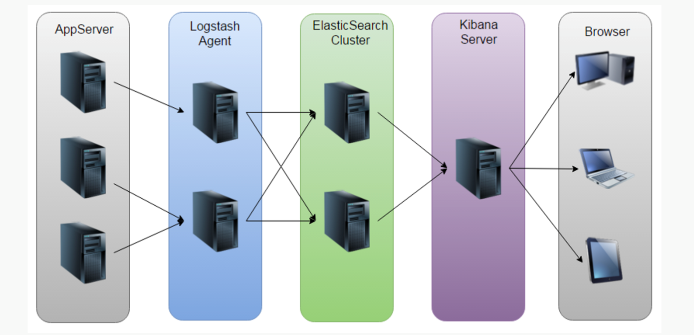
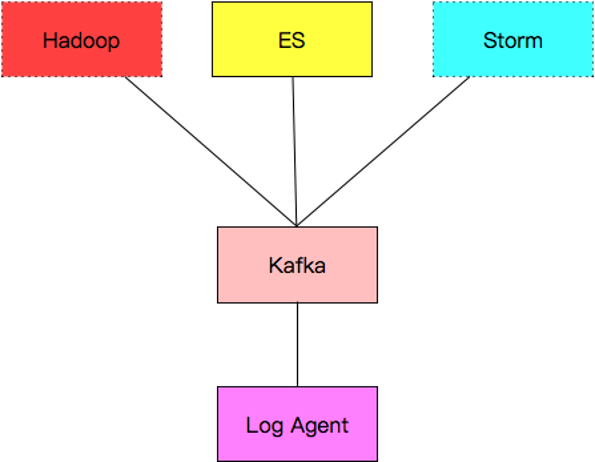
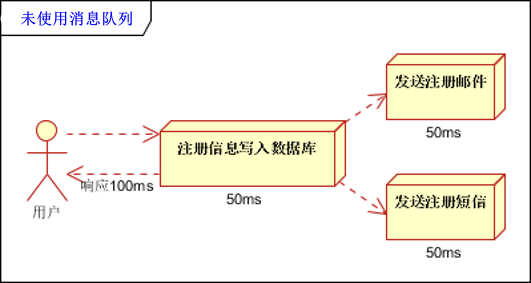
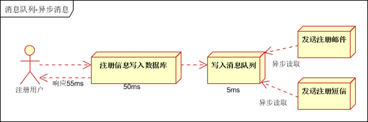
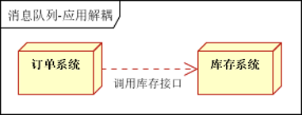
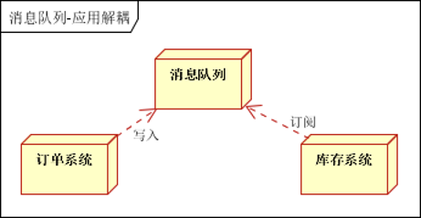
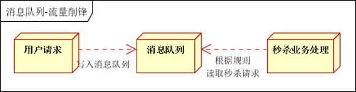
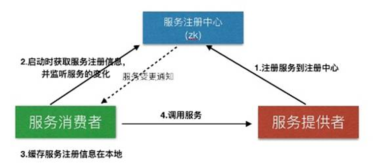
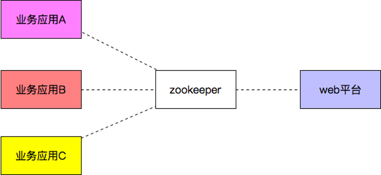

# Golang log

- [Golang log](#golang-log)
  - [Kafka](#kafka)
  - [zookeeper](#zookeeper)

Problems:
- 每个系统都有日志，当系统出现问题时，需要通过日志解决问题; 日志的内容可以被收集用于数据分析;
- 当系统机器比较少时，登陆到服务器上查看即可满足
- 当系统机器规模巨大，登陆到机器上查看几乎不现实

Solutions:
- 把机器上的日志实时收集，统一的存储到中心系统
- 然后再对这些日志建立索引，通过搜索即可以找到对应日志
- 通过提供界面友好的web界面，通过web即可以完成日志搜索

Features:
- 实时日志量非常大，每天几十亿条
- 日志准实时收集，延迟控制在分钟级别
- 能够水平可扩展, 方便扩容

业界方案：ELK
- 运维成本高，每增加一个日志收集，都需要手动修改配置
- 监控缺失，无法准确获取logstash的状态
- 无法做定制化开发以及维护
> 

Custom architecture:
- Log Agent，日志收集客户端，用来收集服务器上的日志，每一台业务机器上都有LogAgent
- Kafka，高吞吐量的分布式队列，linkin开发，apache顶级开源项目；可以用于数据解耦；也可以用RabbitMQ(也是消息队列)；更简陋一点可以用Redis实现队列功能；搭建kafka会注册一个zookeeper
- ES，elasticsearch，开源的搜索引擎，提供基于http restful的web接口；在其上可以做web搜索
- Hadoop，分布式计算框架，能够对大量数据进行分布式处理的平台
- Storm, 实时计算框架(数据量大离线计算)
> 

## Kafka

- 异步处理, 把非关键流程异步化，提高系统的响应时间和健壮性
   >   
   >   
- 应用解耦,通过消息队列
   >   
   >   
- 流量削峰
   >   

## zookeeper

用于微服务，方便扩容、自动化、减少运维

- 服务注册&服务发现
  > 
- 配置中心
  > 
- 分布式锁
  - Zookeeper是强一致的
  - 多个客户端同时在Zookeeper上创建相同znode，只有一个创建成功

